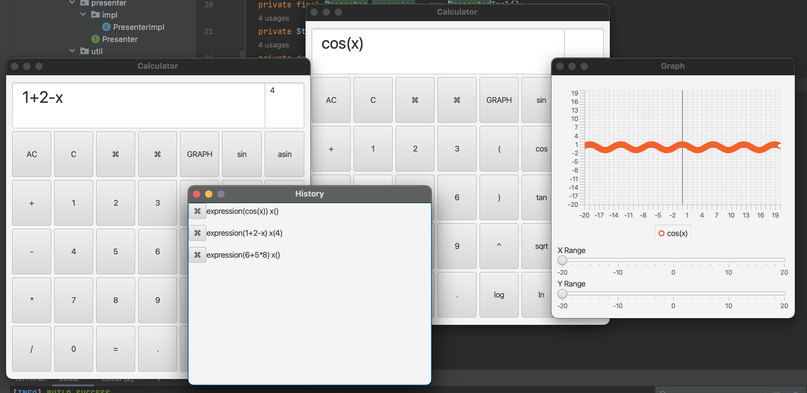

# Описание проекта

Калькулятор с возможностью сохранения истории вычислений и построения графиков функций представлен в виде удобного приложения. Эта программная реализация сочетает в себе преимущества JavaFX для фронтенда и языка C для бэкенда, обеспечивая эффективную работу и гибкость в использовании.

Пользовательский интерфейс калькулятора разработан с использованием JavaFX, что обеспечивает удобство и интуитивно понятное взаимодействие с приложением. Окно для ввода переменной x в правом верхнем углу позволяет пользователям легко управлять значениями переменной при вычислении функций.

Сохранение истории вычислений реализовано с помощью сериализации, что позволяет пользователям легко возвращаться к предыдущим вычислениям, просто нажав на левую кнопку "⌘". Очистка истории вычислений также доступна пользователю при нажатии на правую кнопку "⌘".

Бэкенд калькулятора разработан на языке C, что обеспечивает высокую производительность и эффективное использование ресурсов компьютера. Для сборки динамической библиотеки, необходимой для корректной работы калькулятора, предоставлен Makefile, который учитывает особенности операционной системы пользователя.

Таким образом, данное приложение представляет собой мощный инструмент для выполнения математических вычислений, обеспечивая пользователю удобство использования, эффективность и широкий функционал.

# Сборка

    - Запустите Makefile, выбрав цель вашей операционной системы: make mac/windows/linux.
    
    - Для повторного запуска окна выберите цель open.
    
    - Для очистки выберите цель clean.
    
# Возможности
    
    - Левая ⌘: Посмотреть историю введенных выражений. Нажав на ⌘ в новом окне, можно открыть окно с этим выражением.
    
    - Правая ⌘: Очистить историю.
    
    - GRAPH: Посмотреть график.

# MVP (Model-View-Presenter)

В архитектурном шаблоне MVP (Model-View-Presenter), класс PresenterImpl играет роль посредника между моделью данных (Model) и пользовательским интерфейсом (View). PresenterImpl отвечает за обработку пользовательских действий из View, взаимодействие с Model для получения данных или выполнения операций, и обновление View в соответствии с этими данными.

# CalculatorApp

Класс CalculatorApp представляет собой приложение-калькулятор.
Он наследуется от класса Application из JavaFX.

- gridPane: сетка для размещения элементов интерфейса.
- inputTextArea: текстовое поле для ввода выражения калькулятора.
- xValueTextArea: текстовое поле для ввода значения переменной x.
- object: объект класса DataObject для сохранения истории вычислений.

### Методы:
- start(): инициализирует интерфейс калькулятора.
- createInputTextArea(): создает текстовое поле для ввода выражения калькулятора.
- createButtons(): создает кнопки для калькулятора.
- createXValueTextArea(): создает текстовое поле для ввода значения переменной x.
- handleOperatorButtonClick(): обрабатывает нажатие кнопки оператора.
- handleBackspaceButtonClick(): обрабатывает нажатие кнопки удаления символа.
- handleClearButtonClick(): обрабатывает нажатие кнопки очистки поля ввода.
- handleClearHistoryButtonClick(): обрабатывает нажатие кнопки очистки истории.
- handleSpecialButtonClick(): обрабатывает нажатие кнопки "специальная операция".
- handleGraphButtonClick(): обрабатывает нажатие кнопки построения графика.
- handleHistoryButtonClick(): обрабатывает нажатие кнопки просмотра истории.
- setX(String x): устанавливает значение переменной x в текстовом поле для ввода значения переменной x.
- setExpression(String expression): устанавливает выражение в текстовое поле для ввода выражения калькулятора.

# Класс GraphApp

Класс GraphApp является основным классом приложения для построения графиков функций. Он наследуется от класса Application из JavaFX и используется для инициализации и отображения графического интерфейса.

### Поля
- `presenter`: Presenter - объект для взаимодействия с презентером.
- `equation`: String - строка с математическим выражением для построения графика.
- `minX`, `maxX`: double - минимальное и максимальное значения по оси X.
- `minY`, `maxY`: double - минимальное и максимальное значения по оси Y.

### Методы

- start(Stage primaryStage): Инициализирует и отображает главное окно приложения.
- createLineChart() : LineChart<Number, Number>: Создает и возвращает объект LineChart для отображения графика функции.
- populateSeries(series: XYChart.Series<Number, Number>): Заполняет серию данных графика значениями функции в заданном диапазоне X.
- createSlider(min: double, max: double, initialValue: double) : Slider: Создает и возвращает объект Slider для выбора значений в указанном диапазоне.
- configureSliders(xSlider: Slider, ySlider: Slider, lineChart: LineChart<Number, Number>): Настройка слайдеров для изменения диапазона значений по осям X и Y.
- refreshChart(chart: LineChart<Number, Number>): Обновляет график с новыми данными.
- calculateResult(x: double) : double: Вычисляет значение функции для заданного значения x.
- setEquation(equation: String): Устанавливает математическое выражение для построения графика.
- main(String[] args): Метод main для запуска приложения.

# HistoryApp

Класс HistoryApp представляет собой приложение для отображения истории вычислений.
Он наследуется от класса Application из JavaFX.

### Методы:
- start(): переопределенный метод из класса Application, инициализирует интерфейс графического приложения.
- handleHistoryButtonClick(): обрабатывает нажатие кнопки и восстанавливает предыдущее выражение для вычисления.

Приложение отображает список предыдущих вычислений, полученных из сериализованного объекта DataObject.
При нажатии на кнопку "⌘" происходит восстановление выражения и значения переменной x для дальнейших вычислений
в приложении CalculatorApp.

# DataObject

Класс DataObject используется для представления данных, которые могут быть сериализованы
и десериализованы. Он реализует интерфейс Serializable, что позволяет сохранять
объекты этого класса в файлы и восстанавливать их обратно в объекты в процессе выполнения программы.

### Функционал:
- Список строк: класс содержит список строк, которые могут быть модифицированы с помощью методов setText/getList/clearList.

### Поле serialVersionUID:
Поле serialVersionUID используется для контроля версий сериализованных объектов.
Если значение serialVersionUID не совпадает между сериализацией и десериализацией,
это может указывать на изменения в структуре класса, что может привести к ошибкам десериализации.

# DataManager

Класс DataManager предоставляет статические методы для сериализации и десериализации объектов класса DataObject.

### Методы:
- **serializeData(DataObject object, String filePath):** Метод для сериализации объекта класса DataObject в файл. Принимает объект класса DataObject для сериализации и путь к файлу, в который нужно сохранить сериализованный объект.
- **deserializeData(String filePath):** Метод для десериализации объекта класса DataObject из файла. Принимает путь к файлу с сериализованным объектом и возвращает объект класса DataObject, восстановленный из файла.

# Presenter 

## Константы

- **LIBRARY_NAME**: Константная строка, представляющая путь к нативной библиотеке в зависимости от платформы. Она определяется динамически с использованием класса `Platform`.

## Методы

- `Pointer s21_Input(String str, double x)`: Этот метод отвечает за вызов нативной функции `s21_Input` с указанными строковым и числовым параметрами.

## Загрузка Нативной Библиотеки

Экземпляр интерфейса Presenter загружается с помощью метода `Native.load()`, который загружает соответствующую нативную библиотеку в зависимости от платформы.

# PresenterImpl 

Этот класс представляет реализацию интерфейса `Presenter`.

## Методы

- `Pointer s21_Input(String str, double x)`: Переопределённый метод интерфейса `Presenter`. Возвращает результат вызова метода `s21_Input` у экземпляра `INSTANCE`, передавая ему строковый и числовой параметры.

